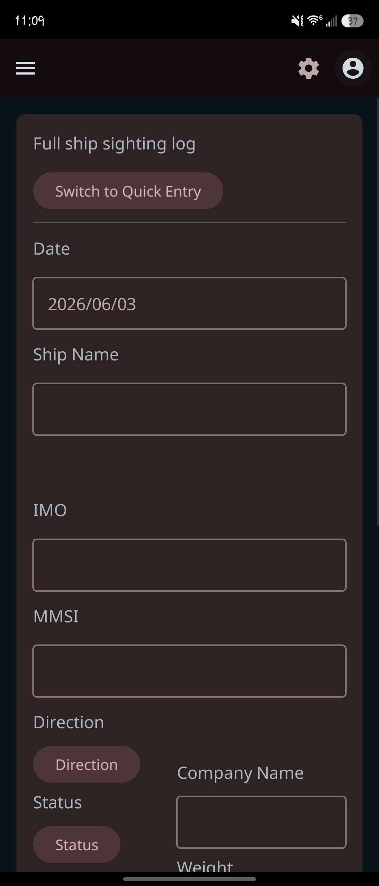
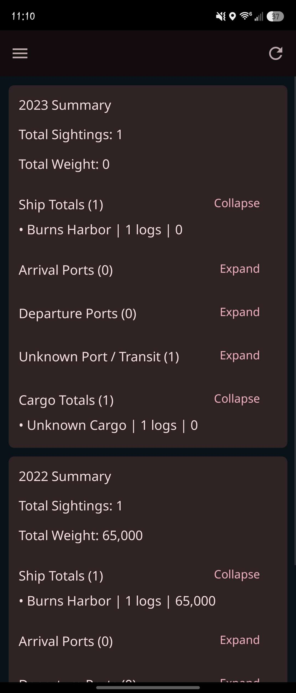
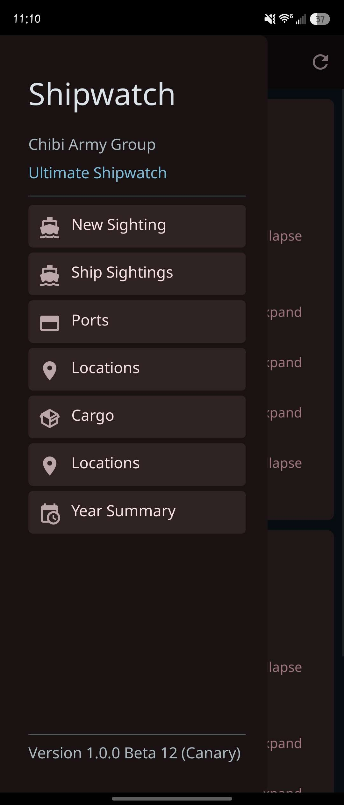
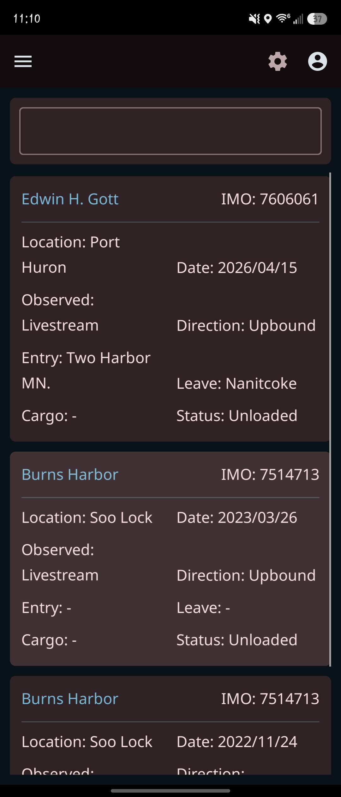

# Ultimate-Shipwatch

Bring shipwatching into the 21st century.

Ultimate-Shipwatch is a modern digital ship logging and vessel tracking
application designed for shipwatchers, enthusiasts, photographers,
and maritime historians worldwide.

While the project currently focuses heavily on Great Lakes shipping due to
its Michigan roots, the long-term vision is to support shipwatching and
vessel tracking across major waterways and regions around the world.

Replace stacks of handwritten logbooks with a powerful mobile-first platform
built for recording ship sightings, cargoes, ports, routes, yearly summaries,
and more.

The project is currently in active development, with a closed beta release
approaching soon.

---

## Features

### Current Features
- Digital ship sighting logs
- Vessel tracking database
- Cargo tracking
- Port tracking
- Year summary statistics
- Offline data storage
- External backups
- Multi-language support
- Mobile-first interface
- Android support

### Planned Features
- AIS-assisted vessel tools
- Smart cargo estimation systems
- Real-time map overlays
- Cloud synchronization
- Multi-device support
- Advanced statistics
- Community-requested tools
- Performance optimization for large historical datasets
- Planned future iOS support
- Tablet and desktop companion support

---

## Current Development

Ultimate-Shipwatch is currently focused on building a fast, practical,
and modern shipwatching experience designed for real-world use near:
- Locks
- Rivers
- Ports
- Harbors
- Shorelines
- Remote observation points

Development is currently centered around:
- UI modernization
- Large dataset optimization
- External backup systems
- Improved vessel organization
- Year summary improvements
- AIS integration groundwork
- Closed beta preparation

---

## Philosophy

Ultimate-Shipwatch aims to preserve and modernize the hobby of shipwatching
while remaining practical, offline-capable, and accessible for both casual
enthusiasts and dedicated long-term vessel loggers.

---

## Platform Support

### Current
- Android

### Planned
- iOS
- Tablets
- Desktop companion tools

---

## Technology Stack

Built primarily using:
- Python
- Kivy
- KivyMD
- SQLite
- Buildozer

---

## Status

Closed beta preparations are currently underway.

Public testing and expanded feature development are planned for future releases.

---

## Screenshots

### Entry Screen

### Year Summary Screen

### Navigation Drawer

### Sightings Screen

---

## Contributing

Community feedback and pull requests are welcome.

Please note that Ultimate-Shipwatch is source-available software.
Official builds and project direction remain managed by Chibi Army Group, LLC.

---

## License

Copyright (C) 2026 Chibi Army Group, LLC

Ultimate-Shipwatch is source-available software.

Viewing and contributing to the source code is permitted; however,
redistribution, commercial use, modified public releases,
and rebranding are prohibited without written permission.

Official builds are distributed only through authorized channels.

---

## Disclaimer

AIS information, cargo estimates, and vessel data may not always be accurate.

Ultimate-Shipwatch is intended for enthusiast and hobbyist use only and
should not be used for navigational, safety-critical, or commercial purposes.
